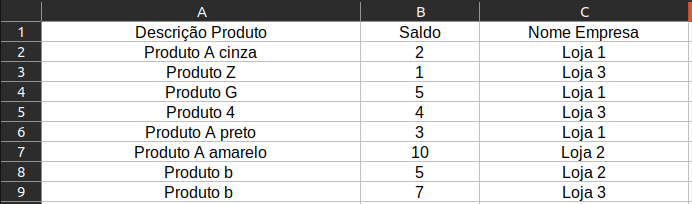
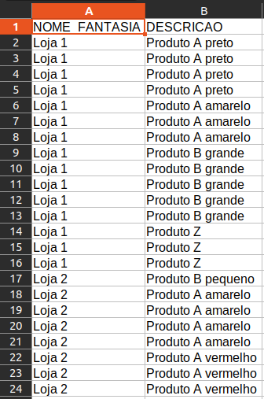
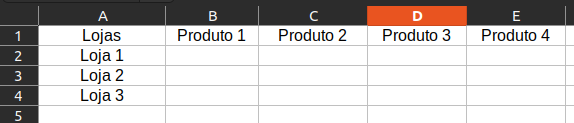
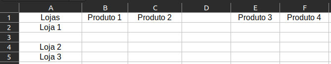
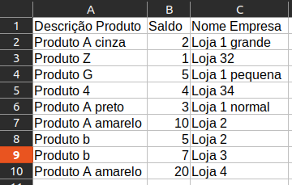

# Sobre o projeto

Um projeto de um pequeno programa para resumir dados de estoque e vendas retirados de extensas planilhas. Foi pensado para uso com planilhas de estruturas bem específicas, então para usar pode ser preciso fazer adptações de acordo com os arquivos a ser utilizado.

# Stack

Foram usadas no projeto as seguintes dependências:

- Pandas - para lidar com os dados
- Tkinter - para a interface
- Unicodedata - para lidar com acentuação
- Traceback - para logs de erros detalhados
- Datetime - para especificar a data e horário dos logs de erros e do relatório gerado

# Interface

A interface é bem simples e consiste de apenas texto e alguns botões

## Botão: Abrir arquivo de estoque

Abre um gerenciador de arquivos para escolher o [arquivo que contém os dados de estoque](#arquivo-de-estoque).

A pasta inicial onde será aberto o gerenciador de arquivos é definida através do botão [`Pasta base`](#botão-pasta-base) detalhado mais abaixo. Apesar de ser possivel defini-la, o usuário é livre para navegar por outras pastas e o arquivo não precisa necessariamente estar dentro dessa pasta base.

## Texto: Escolha um arquivo com os dados de estoque

Ao selecionar um arquivo através do botão, troca o texto para mostrar o nome do arquivo selecionado.

## Botão: Abrir arquivo de vendas

Abre o gerenciador de arquivos para escolher o [arquivo que contém os dados de vendas](#arquivo-de-vendas). Segue as mesmas regras listadas em `Botão: Abrir arquivo de estoque`.

## Texto: Escolha um arquivo com os dados de vendas

Possui o mesmo comportamento que em `Texto: Escolha um arquivo com os dados de estoque`, porém com o arquivo de vendas.

## Botão: Abrir arquivo de base

Tem o mesmo comportamento que os botões anteriores aplicado a [arquivos de base do relatório](#arquivo-de-base).

## Texto: Escolha um arquivo de base para o relatório

Também possui o mesmo comportamento que os textos anteriores aplicado ao arquivo de base do relatório.

## Botão: Gerar relatório

Gera o [relatório](#relatório) na [pasta base](#pasta-base).

## Botão: Sair

Encerra a programa

## Botão: Pasta base

Abre o gerenciador de arquivos para selecionar uma pasta para servir com ponto inicial para abrir os arquivos de dados e como uma pasta destino para o relatório.

# Arquivos e conceitos

Todos os arquivos devem estar em formato .csv e os exemplos de estrutura podem ser encontrados na pasta `templates`.

## Arquivo de estoque

Deve possuir 3 campos de nome exato como descrito abaixo:

- `Nome Empresa`: define a loja onde está o produto
- `Descrição Produto`: define os produtos em estoque na loja
- `Saldo`: indica a quantidade de produtos em estoque na loja.

(acentuação é opcional e não afeta o funcionamento do programa)

As colunas não precisam estar em nenhum tipo de ordem e podem haver outras colunas no arquivo sem problemas.

Exemplo:

## Arquivo de vendas

Deve possuir 2 campos de nome exato como descrito abaixo:

- `NOME_FANTASIA`: define a loja que vendeu o produto
- `DESCRICAO`: define os produtos que foram vendidos na loja

## Arquivo de base

São os arquivos que definem a estrutura final do relatório, é nesse arquivo onde é possível personalizar o relatório definindo quais lojas e quais produtos devem ser incluídos no relatório final.

- A primeira célula (A1) deve ser prenchida com exatamenta `Lojas`
- Definindo lojas: Na coluna A da linha 2 em diante são definidas as lojas. Não deve haver linhas em branco entre a primeira loja e a ultima.
- Definindo produtos: são definidos a partir da coluna A. O nome do produtos são definidos na linha 1 um após o outro, sem colunas em branco até a ultima.

Estrutura correta:

Estrutura errada:

Ao definir as lojas o programa vai percorrer a coluna e procurar nos arquivos nomes que contenham o texto. Se houverem nomes parecidos e preciso usar um nome mais específico.

Ex: Considerando a seguinte planilha

Uma célula no arquivo base preenchida com <mark>Loja 1</mark> vai incluir resultados da <code><mark>Loja 1</mark> grande</code>, <code><mark>Loja 1</mark> pequena</code> e <code><mark>Loja 1</mark> normal</code>, pois todos esse nomes contém <mark>Loja 1</mark>. Para poder diferenciar é preciso usar um nome mais específico no arquivo de base.

Para os produtos funciona da mesma forma. Se quisermos obter os resultados separados é necessário criar uma coluna diferente para cada produto específico diferente.

## Relatório

O relatório vai ser gerado preenchendo os dados na estrutura do arquivo de base.
